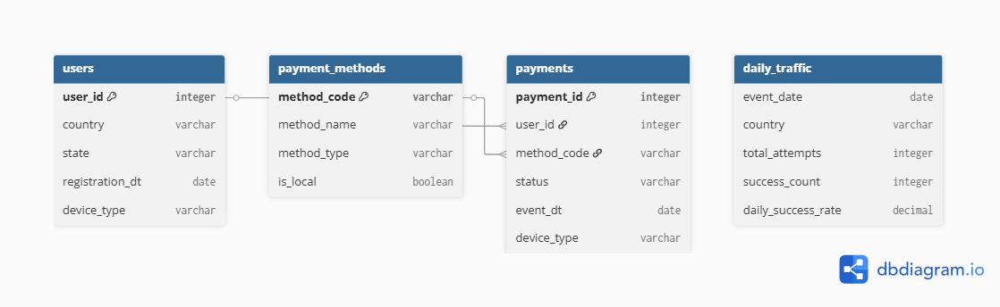
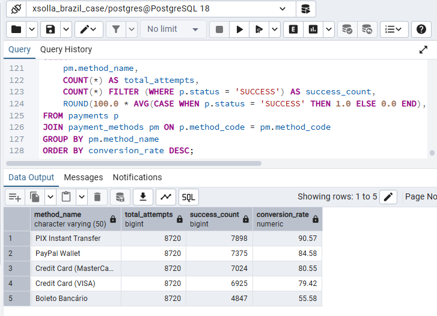
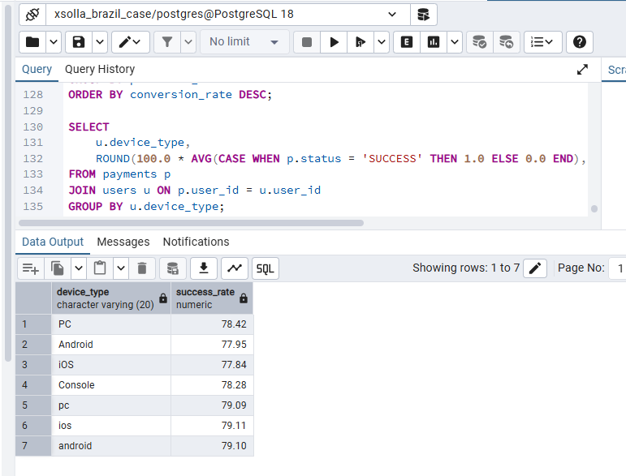
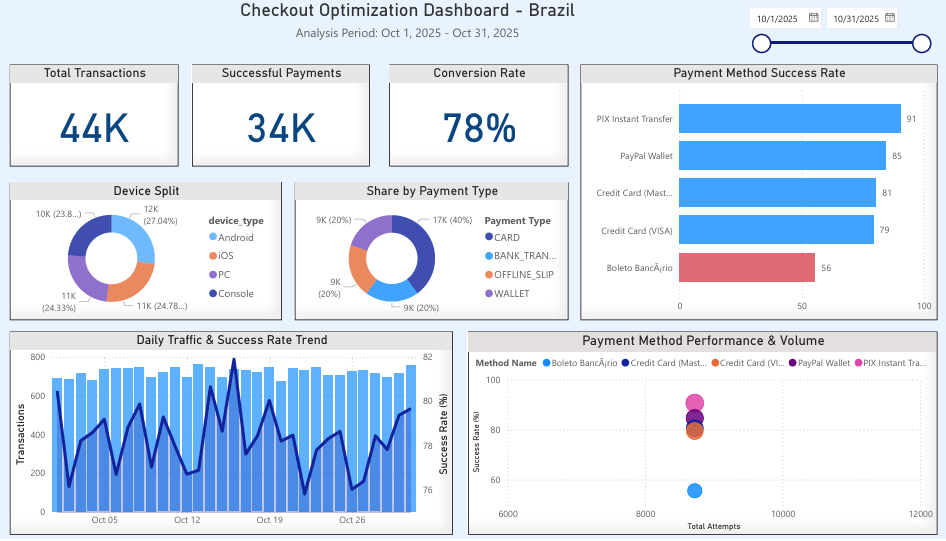

# Xsolla Checkout Optimization Case Study - Brazil Region

### Project Overview
This project simulates a real-world payment conversion analysis for a digital merchant operating in Brazil. The goal is to identify why checkout drop-offs are happening, analyze payment method performance (Boleto vs. PIX vs. Cards), and provide data-driven recommendations to increase the overall **Conversion Rate**.

**Role:** Business Analyst / Product Owner  
**Tools Used:** SQL (PostgreSQL), Power BI, Data Modeling, Excel

## 1. The Challenge & Objective
The Product Team noticed a stagnation in checkout conversion rates in the Brazil region. The objective was to:
1.  Analyze transaction data to detect failure patterns.
2.  Compare local payment methods (Boleto, PIX) against global ones.
3.  Build a monitoring dashboard for the stakeholders.
4.  Propose an optimization roadmap.
   
 ## 2. Data Modeling & Schema
To perform this analysis, I designed a **Star Schema** model optimized for analytics. The dataset includes **44,000+** simulated transaction records.



* **Fact Table:** `payments` (Contains every transaction attempt, status, and timestamp).
* **Dimension Tables:** `users` (Demographics, devices) and `payment_methods` (Method type, local vs global status).
* **Aggregated Table:** `daily_traffic` (Contains summarized daily statistics, such as total attempts and success rates, grouped by country).
---

## 3. SQL Analysis & Key Findings

### A. Identifying the Problem (Payment Method Performance)
I aggregated transaction attempts and calculated the success rate for each method to find the bottleneck.

```sql
SELECT
    pm.method_name,
    COUNT(*) AS total_attempts,
    COUNT(*) FILTER (WHERE p.status = 'SUCCESS') AS success_count,
    ROUND(100.0 * AVG(CASE WHEN p.status = 'SUCCESS' THEN 1.0 ELSE 0.0 END), 2) AS conversion_rate
FROM payments p
JOIN payment_methods pm ON p.method_code = pm.method_code
GROUP BY pm.method_name
ORDER BY conversion_rate DESC;
```
#### Screenshot of Result:


### Finding:
- PIX is the top performer with a ~91% success rate.
- Boleto Bancário is the main bottleneck with only ~56% success rate.
- Credit Cards perform steadily around 80%.

### B. Device & Traffic Analysis
To ensure there were no technical bugs on specific platforms, I analyzed performance by device type.

```sql
SELECT 
    u.device_type,
    ROUND(100.0 * AVG(CASE WHEN p.status = 'SUCCESS' THEN 1.0 ELSE 0.0 END), 2) as success_rate
FROM payments p
JOIN users u ON p.user_id = u.user_id
GROUP BY u.device_type;
```
#### Screenshot of Result:
 

### Finding: 
Success rates are consistent across Android, iOS, and Web (~79-82%), **indicating no platform-specific technical bugs**.

---

## 4. Interactive Dashboard (Power BI)
I built an interactive dashboard to allow stakeholders to monitor health metrics and drill down into daily trends.



### Dashboard Highlights:
- **KPI Cards:** Immediate view of Total Volume (44K), Successful Payments (34K), and Conversion Rate (78%).
- **Bubble Impact Map:** Visualizes the high volume / low performance of Boleto (Blue Bubble) vs. the high value of PIX (Pink Bubble).
- **Trend Line:** Monitors daily stability to rule out server outages or seasonal spikes.
---

## 5. Business Recommendations
Based on the data analysis, here is the proposed optimization roadmap:

### Priority 1: Promote PIX (The "Quick Win")
- **Observation:** PIX has a 91% success rate but lower volume than cards.
- **Action:** Move PIX to the top of the checkout list and add a "Recommended" badge.
- **Expected Impact:** Immediate uplift in overall conversion by shifting users from low-performing methods to PIX.

### Priority 2: Fix Boleto Friction
- **Observation:** Boleto causes 44% of its users to drop off (likely due to offline payment friction).
- **Action:** Implement an email reminder sequence for users who generate a Boleto but don't pay.
- **Action:** Reduce the timeout window to free up inventory faster.

### Priority 3: Maintain Device Health
**Observation:** Performance is stable across devices.
**Action:** Continue monitoring via the dashboard to catch any regression in future app updates.

## Project Structure

The repository is organized as follows:

```text
 checkout-optimization-case/
├──  data/                 # Raw datasets (CSV/Excel) used for the simulation
│   ├── users.csv
│   ├── payments.csv
│   ├── payment_methods.csv
│   └── daily_traffic.csv
├──  sql/                  # SQL scripts
│   ├── schema_setup.sql     # Database creation and table DDL
│   └── analysis_queries.sql # Queries used for insights (KPIs, Trends)
├──  images/               # Visual assets for README
│   ├── dashboard.png        # Final Power BI Dashboard screenshot
│   └── ER.png               # Entity Relationship Diagram
├──  analysis.pbix         # Power BI project file
└──  README.md             # Project documentation and summary
